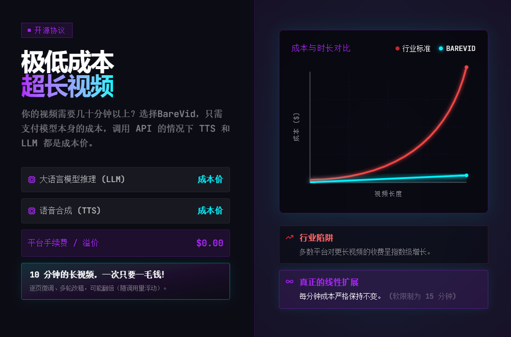
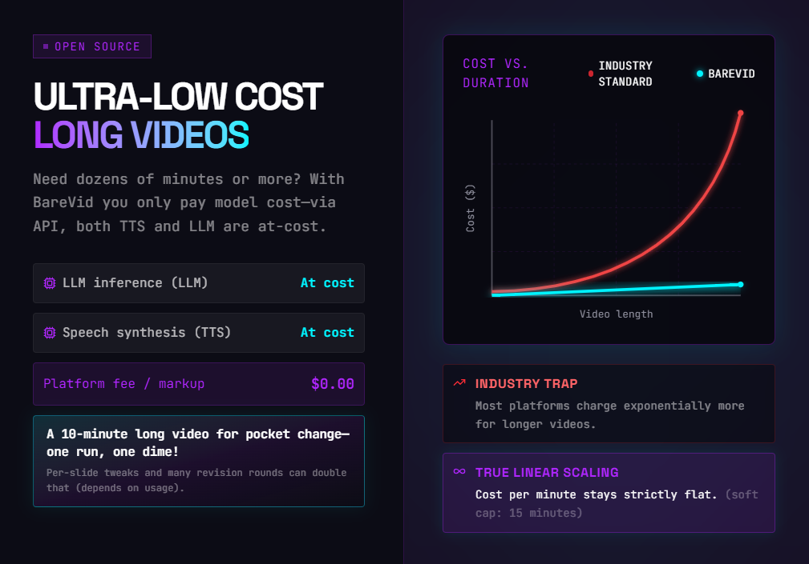

# Barevid

**Paste any article → One Barevid project gives you three ways to use the same content:**

- **A video** — timed playback with **TTS voiceover**, **subtitles**, and animated slides (in the editor / export pipeline, and **mp4** export when you need a file).  
- **A slide deck** — a **public share URL** (`/share/:token`): open in the browser, **flip slides** with keyboard or buttons—**PowerPoint-style**. The share player is **manual and presentation-first** (no autoplay narration in that view—see [`SharePage.tsx`](SlideForge/frontend/src/play/SharePage.tsx)).  
- **A speech coach** — AI-generated **script** plus **reference audio** from the pipeline: listen and imitate, copy or export the narration text, rehearse, then **you** present live against the share link (great for English talks and pronunciation drills).

**Same pipeline. Three workflows.** **~$0.015 per 10 minutes** of typical API spend—on the order of **3000× cheaper** than Runway-style per-second pixel billing (see the charts below).

[▶ Try online](https://barevid.creepender.top) · [🌐 Marketing site](https://barevidweb.creepender.top/) · [📦 Desktop app](https://github.com/apppplepie/barevid/releases) · [🎬 See it in action](https://b23.tv/vvnQNTF)


<p align="center">
  
</p>
<p align="center">
  
</p>

---

## Who is this for?

- **Short-form / edu creators** — turn long articles into publishable explainer videos  
- **Presenters** — one link opens fullscreen paging with **slide animations** built in; no PowerPoint install for the audience  
- **English learners** — same topic: **native-sounding VO + script** for listen-and-repeat, then present from memory  
- **Teachers** — materials work as self-study video *and* as a **click-through web deck**  
- **Anyone** paying **~$50/month** for Gamma / HeyGen / Runway when all you need is **clear narration + voice + slides**  

---

## Why Barevid?

Instead of burning credits generating pixel-perfect video frames, Barevid uses **structured narration + paginated slides + TTS** for explainer-style clips—the cost scales with **tokens and speech**, not fake video seconds.

**Shareable playback:** A public **`/share/:token`** link loads a **fullscreen, chromeless** player (no editor chrome—[`PlayLayout.tsx`](SlideForge/frontend/src/play/PlayLayout.tsx)). The share route uses **manual paging** and is optimized like a **web slide deck** ([`SharePage.tsx`](SlideForge/frontend/src/play/SharePage.tsx)). For **TTS + subtitles + timeline**, use the normal play/export flows or the **mp4** output. Query flags like `?clean=1` or `?export=1` also strip chrome for clean screen capture.

<div align="center">

**[中文](#readme-zh)** · **[English](#readme-en)**

</div>

<a id="readme-zh"></a>

## 中文

**Barevid** 是一套「**大段文章/一句话指令 → 带配音的幻灯片视频**」的开源自动化方案。放弃每秒钟生成像素点，改用 **结构化讲稿 + 分页放映 + TTS** 做出 **讲解型** 的小视频。

**一条内容，三种用法：** 同一套工程既可 **导出/播放带配音字幕的小视频**，也可发 **`/share/:token` 公开链接** 让对方像 **PPT 一样手动翻页**（分享页当前为手动放映、偏演示）；也可以**导出台词**，再自己对着分享页练习讲演。

### 适合谁？

- **做短视频/知识向内容的创作者**——把长文变成可发的讲解视频  
- **要讲 PPT 的人**——一条链接打开全屏翻页，自带动画，不必每人装 PowerPoint  
- **学英语的学生**——同一主题下拿 **母语感口播 + 文稿** 当听力/跟读材料，再脱稿自己讲  
- **老师做课**——既是自学向视频，又能当 **可点击放映的网页幻灯**  
- **受够了 Gamma / HeyGen / Runway 按月几十刀**、但只需要「讲清楚 + 配音 + 幻灯」的人  


| 入口 | 链接 |
|------|------|
| **宣传站**（介绍、定价叙事、状态页） | [barevidweb.creepender.top](https://barevidweb.creepender.top/) |
| **在线应用**（直接做项目、出片） | [barevid.creepender.top](https://barevid.creepender.top/) |
| **桌面版安装包** | [GitHub Releases](https://github.com/apppplepie/barevid/releases) |
| **演示视频**（B 站 · 项目讲解与试用） | [b23.tv/vvnQNTF](https://b23.tv/vvnQNTF) |
| **源码** | [github.com/apppplepie/barevid](https://github.com/apppplepie/barevid) |
| **作者博客**（有反馈往这边放，但需要注册账号） | [creepender.top](https://creepender.top/) |

## 我们的优势？

### 1. 成本低，而且「线性」

钱主要花在 **大模型编写 HTML 画面** 和 **语音合成** 上，**没有按视频秒数给「生成画面」厂商交税**。片子变长，大致是 **多念几句、多写几个 HTML** 的增量。

和 Runway 一类 **按 credits/秒** 的像素生成路线比，Barevid 更适合 **课、汇报、科普、内部培训** 这种 **信息密度高、画面不必电影级** 的~~糊弄任务~~场景。

### 2. 能自动化：批量、脱手、少折腾

管线设计成 **「一段提示 → 脚本 / 配音 / 演示画面」自动变成小视频**——**适合想少动手、把重复劳动交给流程的人**。

### 3. 自由度高：每一页都能手写

如果自动化的结果不满意，你也可以对结果进行改动，不是**一条 prompt 出来就只能全盘接受**：

- **逐页改台词、改节奏**——改一页不必整条重生成。
- **每一步都可以反复重来**——页面不满意就重跑 LLM，某段声音不对就重跑 TTS。
- **风格可以自己写进提示词**——主题、语气、版式方向都能往 prompt 里塞。


---

## 这和「一键 AI 成片（像素级）」有什么不一样？

| 路线 | 在干什么 | 成本直觉 |
|------|----------|----------|
| **像素级文生视频** | 直接生成镜头、运动、光影 | 常按 **秒 / credits** 计费；改一句台词往往 **整段重跑**。 |
| **Barevid** | **幻灯 + 时间轴 + TTS** | 主要为 **token + TTS** 付费；**时长和「念完」绑定**，而不是和「每一帧假视频」绑定。 |

## 也有代价!

省钱的代价是 **时间**。从「各段合成好了」到「手里有一个可下载的成片」，中间还要 **导出编码（常见是 Worker 按真实时间轴录屏 + ffmpeg）** 和 **传到你本地**，整体体感经常是：**等多久 ≈ 成片时长的 1.5 倍左右**（机器负载、分辨率、网络会有浮动）。也就是10min的时间可能需要15min才能合成好，视频越长合成的时间越长，如果要自行调整将会耗时更长。

---

## 仓库里到底有什么？

```
barevid/
├── docker-compose.yml   # 根目录一键：MySQL + SlideForge 后端/前端 + 导出 Worker（推荐）
├── barevidweb/          # 可选：对外宣传站（Vite/React）；默认 compose 不包含，需单独部署见该目录
├── docs/demo/           # 可选：README/文档用的演示短视频（mp4/webm）
├── SlideForge/          # 主应用：FastAPI 后端 + Vite/React 前端（亦可单独 docker compose）
├── electron/            # 可选：Barevid 桌面端（Electron，Windows 安装包）
├── worker/              # 导出 Worker：Playwright + ffmpeg；根 compose 会构建并运行
└── README.md            # 本文件
```

- **SlideForge**：自托管时你要起的 **后端 + 前端**；目录名是历史遗留，**和对外叫 Barevid 不冲突**。
- **worker**：可以理解成 **专门干重活的导出节点**——不占满 API 进程；一台机器跑也行，多台机器一起 **分布式拉任务** 也行（用约定密钥跟后端对话）。

当前一条典型链路（实现可换供应商）：**杂乱文本 → LLM 整理结构 → TTS 按段出音 → LLM写每一页 HTML 代码作为画面演示 → 前端按真实时长走时间轴 →（可选）Worker 录屏编码成 mp4**。**段级时长回写**，减少「画面对不上嘴」的玄学。

---

## 后期计划？

优先级按成本排：

1. **Coqui 等本地 TTS**：把语音合成压到 **零 API 账单**。代价可能是更长的等待时间（但为了降低成本这是可接受的，毕竟原本就已经等的够长了，不少那几分钟）。
2. **声线克隆 / 自定义音色**：这意味着你可以克隆自己的语音假装视频是自己古法制作~~更好的糊弄任务~~。
3. **自动塞图**：提示词或规则驱动，把给定素材 **插进对应页**。
4. **自动图表**：数据进来 → 页面上 **出图、出表**，更精准的数据对比。

欢迎 PR：**文档、国际化、Coqui 集成示例、Docker Compose 一键起全栈** 等。

---

## 快速开始

### Docker 一键（SlideForge + Worker）

适合：**clone 整仓**后在一台机子上用 Docker 跑通编辑与**视频导出**（需 Docker Compose **v2.24+**，支持 `include`）。

1. 安装 [Docker Desktop](https://www.docker.com/products/docker-desktop/)（Windows 建议启用 WSL2 后端）。
2. 复制 `SlideForge/backend/.env.example` → `SlideForge/backend/.env`，填写 `DEEPSEEK_API_KEY`、豆包 TTS、`EXPORT_WORKER_TOKEN` 等（与 [SlideForge/README.md](./SlideForge/README.md)「准备」一致）。
3. 复制仓库根 `.env.example` → `.env`，设置 `EXPORT_WORKER_TOKEN`（须与 `SlideForge/backend/.env` 里同名变量一致；根 `.env` 会经 compose 注入后端与 Worker，覆盖同名项）。
4. 在**仓库根目录**执行：

   ```powershell
   cd <你的仓库根目录>
   docker compose up -d --build --quiet-build
   ```

   `--quiet-build` 会**隐藏构建日志**（含 Worker 镜像），终端少一大截输出；拉基础镜像时若仍嫌吵，可再加 `--quiet-pull`。

5. 浏览器打开 `http://127.0.0.1:3000`；API `http://127.0.0.1:8000`；MySQL `127.0.0.1:3307`。

仅起 SlideForge 三件套（**不要** Worker）、或只拉镜像不 build：见 **[SlideForge/README.md](./SlideForge/README.md)** 的 Docker 小节。

**服务器上**已用 `scripts/dbp.ps1` push 新镜像后要更新容器，在仓库根建议：

```powershell
docker compose pull --policy always
docker compose up -d --build --quiet-build
```

`pull --policy always` 避免 `:latest` 仍用宿主机旧层；含 Worker 时保留 `--build` 以便必要时重编 worker 镜像。

### 服务器目录（扁平部署，不等同于 clone 整仓）

文档里常以仓库里的 **`SlideForge/`** 为「compose 工作目录」。若你在机器上**只同步主应用这一块**，目录可以和仓库不同名，只要 **相对关系与 `SlideForge/docker-compose.yml` 一致** 即可。

示例（常见）：

```
/srv/barevid/
├── docker-compose.yml      # 内容与 SlideForge/docker-compose.yml 对齐（或同文件）
├── docker/                 # 对应仓库 SlideForge/docker/（含 mysql-init/barevid.sql）
├── storage/                # 对应 SlideForge/storage
├── backend/                # 对应 SlideForge/backend（含 .env）
├── barevidweb/             # 可选，对应仓库 barevidweb/（宣传站单独 build，主 compose 可不包含）
├── .env                    # 可选，给 compose 做变量替换（镜像名、EXPORT_*、bind 等）
├── backend/.env            # 后端密钥，必填项见 SlideForge/backend/.env.example
└── nginx-test.conf         # 自建边缘反代时用，与 compose 无强耦合
```

在此布局下在 **`/srv/barevid`** 执行 `docker compose pull --policy always` 与 `docker compose up -d` 即可；**不要**要求本机必须存在名为 `SlideForge` 的目录，关键是 **`./storage`、`./docker/...`、`backend/.env` 相对 compose 文件的路径正确**。

若你使用**仓库根**的 `docker-compose.yml`（含 Worker、`include`），则仍须在**含 `SlideForge/`、`worker/` 的整仓克隆**下运行；扁平服务器上通常只用 **SlideForge 那份**三件套 compose，Worker 另机跑或再单独同步 `worker/`。

### 本机开发（无 Docker）

细节以 **[SlideForge/README.md](./SlideForge/README.md)** 为准：

1. 配置并启动 **SlideForge/backend**（Python）与 **SlideForge/frontend**（Node）。
2. 按需配置 **worker/.env** 与后端的导出相关环境变量，启动 `worker_export_video.py`。

### 桌面客户端（Electron · Windows）

仓库内 **`electron/`** 提供 **Barevid 桌面版**：内置本地页面与 API 代理，可选捆绑本机 API / 导出能力（以你本地的 `electron-builder` 与脚本配置为准）。**在 `electron/` 目录下**执行（需已安装 Node）：

| 命令 | 说明 |
|------|------|
| `npm install` | 安装依赖（首次） |
| `npm run build` | 构建前端 + 编译 TS + **打 Windows 安装包**（NSIS），产物在 **`electron/release/`** |
| `npm run build:win:nobackend` | 同上，但不走完整 `build-win-full.ps1`（仅前端 + 打包） |
| `npm run build:win` | 走 **`scripts/build-win-full.ps1`** 的完整流程（含后端/worker 等约定步骤） |

安装包文件名类似 **`Barevid Setup 0.1.0.exe`**（版本以 **`electron/package.json`** 的 `version` 为准）。首次使用需在应用内填写 **DeepSeek / 豆包 TTS** 密钥，或编辑用户数据目录下的 **`api-secrets.env`**（与界面保存同步）。

**发布到 GitHub（New release）可参考：**

1. **Tag**：与桌面版版本对齐，例如 **`v0.1.0`**（与 `electron/package.json` 的 `version` 一致，便于对照）。
2. **Title（标题）**：例如 **`Barevid Desktop v0.1.0 · Windows x64`**。
3. **Release notes（正文）**可写清：支持系统（如 Windows 10/11 x64）、这是 **实验性/首个** 桌面构建、主要功能（本地打开应用、配置 API 密钥、导出等）、**已知问题**。（校验哈希不必写，需要时自行补充即可。）
4. **Assets**：把 **`electron/release/`** 里生成的 **`*.exe`**（以及可选的 `latest.yml` 若你做自动更新）拖到 Release 附件；**不要把真实 API 密钥写进 Release 说明**。

---

## 线上平台当前小限制

在线版目前先把 **单个视频时长限制在 3 分钟内**。

主要是服务器眼下只剩 **30G 存储空间**，而且还是一台 **4G 小机器**，网络偶尔也会失联术。视频一长，导出文件、缓存、上传下载和重试都会明显变重，所以这个限制属于**迫不得已的配置**。

worker节点没办法放在我的服务器上，只能放在我本地cpu好一点的主机上，但是由于我晚上要睡觉，主机吵的我睡不着，只有白天的时候worker才开着。这意味着**导出视频前需要先看worker是否在线，如果不在线，那就无法导出视频**。

如果你是自部署玩家，这个限制可以在后端环境变量里自己调大：`MAX_TARGET_NARRATION_MINUTES`。

## 不想折腾？有代办

如果你现在的情况是：

- 网络时好时坏，在线平台不一定稳稳打开
- 不想自己部署，也不想慢慢研究环境变量
- 只想赶紧把片子做出来

那也可以直接走一个省心路线：我朋友在闲鱼和小红书都接 **Barevid 私人定制代做**，适合想快速出片的人。

- 闲鱼店链接：[这是我的闲鱼号，快来看看吧](https://m.tb.cn/h.inNhqmi?tk=xeeZ5UCPdRn)
- 小红书主页：我已入驻 REDCity，来看看我的主页 >> [点击打开](https://xhslink.com/m/7hKGwAtfMbf)

收费的，但胜在省事。

（上文「也有代价」一节提到的等待时间若不想自己盯，也可以考虑这条代办路线。）

---

## 命名约定（给协作者扫盲）

- **Barevid**：产品 / 仓库对外名称（「白板影像」）。
- **SlideForge**：仓库里主应用的目录名；服务器路径、镜像 tag 继续叫 SlideForge **完全 OK**，文档里对上号就行。

---

## 开源说明

作者以开源形式维护本仓库。**第一次用这个我也不知道怎么搞**。

---

### 参考：市面「像素视频」定价量级（以官网为准，会变）

对比用时请自行查阅各平台当前价目：例如 Runway API 文档中的 [pricing 说明](https://docs.dev.runwayml.com/guides/pricing/)（credits/秒一类）。Barevid 不替代电影感镜头工具，只是 **另一条更省钱、更可控的赛道**。

<a id="readme-en"></a>

## English

**Barevid** is an open automation stack that turns **long-form text or a one-shot prompt** into **narrated slide-style explainer videos**. Instead of generating pixels every second, it uses **structured narration + paginated playback + TTS**.

**One project, three workflows:** export or play a **short video with voiceover and subtitles**; share a public **`/share/:token`** link so others can **page through like PowerPoint** (the share view is manual and presentation-focused); or **export the narration script** and rehearse against that link on your own.

### Who is this for?

- **Short-form / edu creators** — turn long articles into publishable explainer videos  
- **Presenters** — one link opens fullscreen paging with **slide animations** built in; no PowerPoint install for the audience  
- **English learners** — same topic: **native-sounding VO + script** for listen-and-repeat, then present from memory  
- **Teachers** — materials work as self-study video *and* as a **click-through web deck**  
- **Anyone** paying **~$50/month** for Gamma / HeyGen / Runway when all you need is **clear narration + voice + slides**  

### Demo assets & where to put them

- **Walkthrough (Bilibili, Chinese)**: [Barevid — open-source slide-style AI video + online trial](https://b23.tv/vvnQNTF)  
- **In-repo (README / docs)**: **`docs/demo/`** for **gif / mp4 / webm** (hero GIF is **`docs/demo/barevid.gif`**). Large files: **Git LFS**, **Releases**, or external hosting.  
- **Embedding**: Markdown images for gif/stills, or `<video controls src="docs/demo/example.mp4" width="600"></video>` (GitHub rules may change).  
- **Marketing site (barevidweb)**: demo MP4s under **`barevidweb/public/vidsrc/`**, listed in **`manifest.json`**; other assets under **`barevidweb/public/`**.

| Entry | Link |
|------|------|
| **Marketing site** (intro, pricing story, status) | [barevidweb.creepender.top](https://barevidweb.creepender.top/) |
| **Web app** (edit projects, export) | [barevid.creepender.top](https://barevid.creepender.top/) |
| **Desktop installer** | [GitHub Releases](https://github.com/apppplepie/barevid/releases) |
| **Demo video (Bilibili)** | [b23.tv/vvnQNTF](https://b23.tv/vvnQNTF) |
| **Source** | [github.com/apppplepie/barevid](https://github.com/apppplepie/barevid) |
| **Author blog** (feedback welcome; account required) | [creepender.top](https://creepender.top/) |

### What makes Barevid different?

#### 1. Cost stays “linear”

Spend goes mainly to **LLM-generated HTML slides** and **speech synthesis**—**not** per-second “fake video” vendor tax. Longer runs mostly mean **more narration and more HTML pages**.

Versus **credits-per-second** pixel tools like Runway, Barevid fits **lectures, briefings, explainers, internal training**—high information density, **no need for film-grade frames**.

#### 2. Automation-friendly

The pipeline is **one prompt → script / VO / slides → a small video**—good if you want **less manual grind**.

#### 3. Fine-grained control

You can edit results without accepting a single prompt output wholesale:

- **Per-slide script and pacing** — fix one slide without regenerating everything.  
- **Retry any step** — rerun the LLM for a page, rerun TTS for a clip.  
- **Style in the prompt** — tone, layout hints, and theme go in your instructions.

---

### How is this different from “one-click pixel AI video”?

| Approach | What it does | Cost intuition |
|----------|----------------|-----------------|
| **Pixel text-to-video** | Generates shots, motion, lighting | Often **per second / credits**; one line change may **rerun the whole clip**. |
| **Barevid** | **Slides + timeline + TTS** | Mostly **tokens + TTS**; duration tracks **“time to speak”**, not **every fake frame**. |

### The tradeoff

Saving money costs **time**. After segments are ready, **export** still means **Worker screen capture + ffmpeg** (typical) and **download**—often **~1.5× the video length** in wall-clock time (varies with load, resolution, network). A **10-minute** video might need **~15 minutes** to finish exporting; longer videos take longer, and manual tweaks add more.

---

### What’s in the repo?

```
barevid/
├── docker-compose.yml   # Root: MySQL + SlideForge + export Worker (recommended)
├── barevidweb/          # Optional marketing site (Vite/React); not in default compose
├── docs/demo/           # Optional: short demo clips for README/docs (mp4/webm)
├── SlideForge/          # Main app: FastAPI + Vite/React (or its own compose)
├── electron/            # Optional: Barevid Desktop (Electron, Windows installer)
├── worker/              # Export worker: Playwright + ffmpeg
└── README.md
```

- **SlideForge** is the historical folder name for the main app; product name is still **Barevid**.
- **worker** is the **heavy export node**—off the API; one machine or many workers can pull jobs (**shared secret** with the backend).

Typical pipeline: messy text → LLM structures content → TTS per segment → LLM writes HTML per slide → frontend follows a real timeline → (optional) worker records/encodes **mp4**. **Per-segment duration write-back** reduces lip-sync drift.

**Sharing:** **`/share/:token`** is a **manual, deck-style** player ([`SharePage.tsx`](SlideForge/frontend/src/play/SharePage.tsx)); chromeless shell ([`PlayLayout.tsx`](SlideForge/frontend/src/play/PlayLayout.tsx)). **TTS + subtitles + timeline** use the main editor/export path or **mp4** output.

---

### Roadmap (cost-driven priority)

1. **Local TTS (e.g. Coqui)** — drive speech cost toward **zero API spend**; may wait longer.  
2. **Voice cloning / custom voices** — sound more like you (or your “ancient handmade video” persona).  
3. **Auto-insert images** — rules or prompts to **drop assets on the right slides**.  
4. **Auto charts** — feed data → **plots and tables** on slides.

PRs welcome: **docs, i18n, Coqui examples, Docker Compose polish**, etc.

---

### Quick start

#### Docker (SlideForge + Worker)

Best for: **clone the full repo** and run edit + **video export** on one machine (Docker Compose **v2.24+** with `include`).

1. Install [Docker Desktop](https://www.docker.com/products/docker-desktop/) (Windows: WSL2 backend recommended).  
2. Copy `SlideForge/backend/.env.example` → `SlideForge/backend/.env` — fill `DEEPSEEK_API_KEY`, Doubao TTS (`DOUBAO_*`), `EXPORT_WORKER_TOKEN`, etc. ([SlideForge/README.md](./SlideForge/README.md) “Setup”).  
3. Copy repo root `.env.example` → `.env`; set **`EXPORT_WORKER_TOKEN`** (must match the backend file; root `.env` is injected into backend and Worker).  
4. From the **repo root**:

   ```powershell
   cd <your-repo-root>
   docker compose up -d --build --quiet-build
   ```

   `--quiet-build` hides noisy build logs; add `--quiet-pull` if pulls are too chatty.

5. Open **`http://127.0.0.1:3000`** (app), **`http://127.0.0.1:8000`** (API), MySQL **`127.0.0.1:3307`**.

SlideForge **without** Worker, or pull-only flows: see **[SlideForge/README.md](./SlideForge/README.md)**.

**After pushing images** (e.g. `scripts/dbp.ps1`), on the server from repo root:

```powershell
docker compose pull --policy always
docker compose up -d --build --quiet-build
```

`pull --policy always` avoids stale `:latest` layers; keep `--build` when Worker images must rebuild.

#### Flat server layout (not a full git clone)

Docs often use **`SlideForge/`** as the compose root. If you only sync the main app, folder names can differ as long as paths match **`SlideForge/docker-compose.yml`**.

Example:

```
/srv/barevid/
├── docker-compose.yml      # Same idea as SlideForge/docker-compose.yml
├── docker/                 # e.g. mysql-init/barevid.sql
├── storage/
├── backend/                # SlideForge/backend + .env
├── barevidweb/             # Optional marketing site
├── .env
├── backend/.env
└── nginx-test.conf         # Optional edge reverse proxy
```

Run `docker compose pull --policy always` and `docker compose up -d` from **`/srv/barevid`**; what matters is **`./storage`**, **`./docker/...`**, **`backend/.env`** relative to the compose file.

The **repo root** `docker-compose.yml` (with Worker + `include`) needs a clone that includes **`SlideForge/`** and **`worker/`**; flat servers often run only the **SlideForge** compose and run Worker elsewhere or sync **`worker/`** separately.

#### Local dev (no Docker)

See **[SlideForge/README.md](./SlideForge/README.md)**:

1. Run **SlideForge/backend** (Python) and **SlideForge/frontend** (Node).  
2. Configure **`worker/.env`** and backend export env vars; run **`worker_export_video.py`** as needed.

#### Desktop app (Electron · Windows)

From **`electron/`**:

| Command | Purpose |
|--------|---------|
| `npm install` | Install deps (first time) |
| `npm run build` | Build web + TS + **Windows installer (NSIS)** → **`electron/release/`** |
| `npm run build:win:nobackend` | Same without full `build-win-full.ps1` |
| `npm run build:win` | Runs **`scripts/build-win-full.ps1`** |

Installer names like **`Barevid Setup 0.1.0.exe`** (version from **`electron/package.json`**). Enter **DeepSeek / Doubao TTS** keys in-app or in user-data **`api-secrets.env`**.

**GitHub Release:** tag **`v0.1.0`**, title e.g. **`Barevid Desktop v0.1.0 · Windows x64`**, OS + highlights + known issues; attach **`*.exe`** from **`electron/release/`**; **never** put real API keys in release notes.

---

### Hosted platform limits

The public instance caps **single export length at ~3 minutes**, mainly due to **~30 GB disk**, a **4 GB RAM** box, and flaky network—longer videos stress storage, cache, transfers, and retries. Self-hosters can raise **`MAX_TARGET_NARRATION_MINUTES`**.

The **export Worker is not on this server**—it runs on a **stronger local machine**. It’s only on **during the day** (nights off so the machine doesn’t stay noisy). **Before exporting, check that the Worker is online**; if it’s down, **export won’t run**.

### Rather not DIY?

If the network is flaky, you don’t want to self-host, or you need a video **now**, there is **paid custom help** on Chinese marketplaces (see the Chinese section for **闲鱼 / 小红书** links). The “tradeoff” section above applies if you’d rather not wait on exports yourself.

---

### Naming

- **Barevid**: product name (“whiteboard video”).  
- **SlideForge**: folder name for the main stack; server paths and image tags may still say SlideForge.

---

### License / openness

Maintained as open source. PRs welcome: docs, i18n, Coqui TTS examples, Docker polish, etc.

---

### Reference: “pixel video” pricing (check vendors)

Example: Runway API [pricing](https://docs.dev.runwayml.com/guides/pricing/) (credits per second). Barevid is a **different, cheaper, more controllable** lane for explainer slides—not a replacement for cinematic generators.
